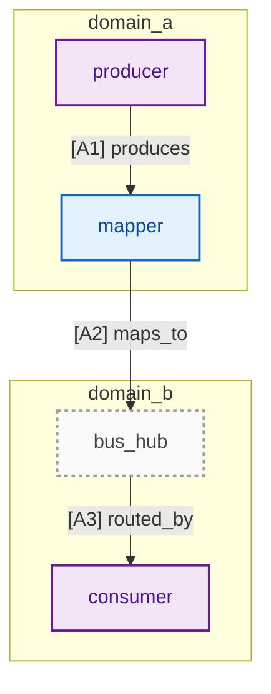
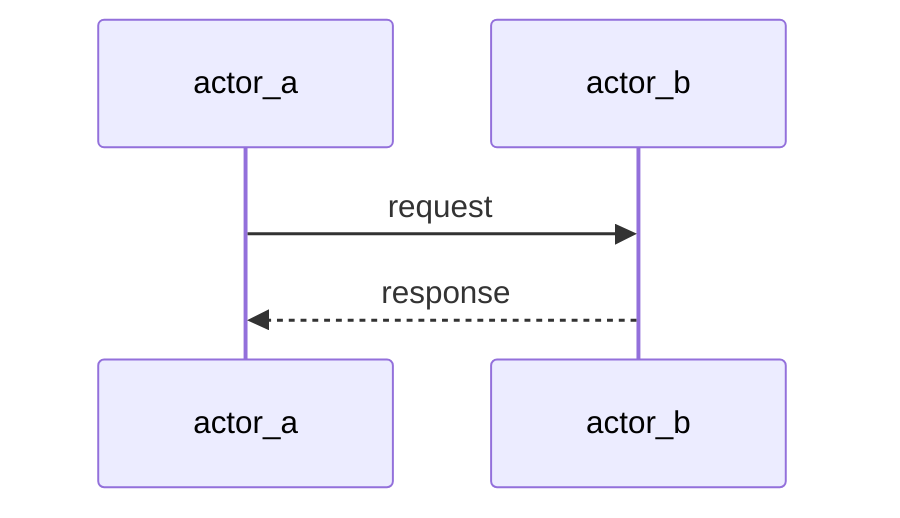
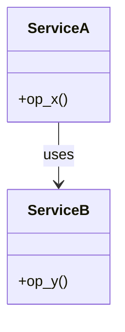
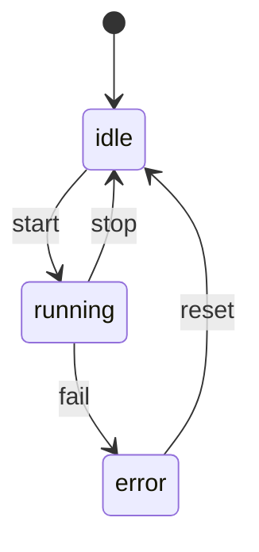
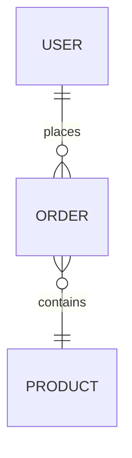
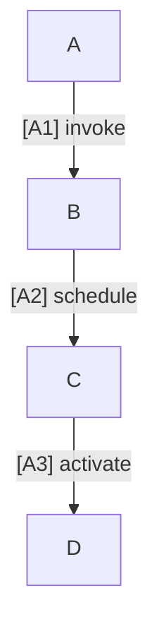

# Mermaid 通用规约（更新版：含换行与兼容经验）

## A. 初始化

将以下片段放在每张图最顶部，紧接其后写 `flowchart TB`（或 `flowchart LR`）：

```mermaid
%%{init:{
  "themeVariables":{"fontSize":"30px","padding":24,"lineHeight":"1.2","fontFamily":"Inter,Arial"},
  "flowchart":{"nodeSpacing":200,"rankSpacing":220,"diagramPadding":32,"htmlLabels":true,"useMaxWidth":false,"arrowMarkerAbsolute":false}
}}%%

```

> 如某平台对 init 有兼容性问题，调试时可暂时整体删除 init 块，只保留结构语句，确认通过后再逐项加回。
> 

---

## B. 配色

把配色放在 `flowchart TB` 之后：

```mermaid
classDef L_logic fill:#E3F2FD,stroke:#1565C0,stroke-width:2px,color:#0D47A1;
classDef L_alloc fill:#FFF3E0,stroke:#EF6C00,stroke-width:2px,color:#E65100;
classDef L_net   fill:#E8F5E9,stroke:#2E7D32,stroke-width:2px,color:#1B5E20;
classDef L_unit  fill:#F3E5F5,stroke:#6A1B9A,stroke-width:2px,color:#4A148C;
classDef L_hub   fill:#FAFAFA,stroke:#9E9E9E,stroke-dasharray:3 3,stroke-width:2px,color:#424242;

```

---

## C. 边标签词库（动词统一）

关系：`relates_to` `uses` `depends_on`

映射：`maps_to` `binds` `assigns`

通道：`via` `carried_by` `routed_by` `attached_to`

发布：`offers` `discovers` `publishes` `subscribes`

控制：`triggers` `activates` `blocks` `unblocks`

> 规则：
> 
> - **语义写在边标签** 上，尽量用上述动词组合编号。
> - **节点名不含关系词**，只表达“是谁”；关系全部交给边。
> - 一行只连一跳：`source --> target`，不要写链式箭头。

**边标签字符约束（重要）：**

- 为兼容不同 Mermaid 版本，**边标签内容建议只用 ASCII 字符**：
    - 大小写字母、数字、下划线、方括号 `[ ]`、空格。
- 避免在边标签中使用：
    - 中文、圆圈数字（①②③）、全角符号、各种括号组合等。
- 如确实需要中文解释，在图外说明或用 Legend，而不是直接写到边标签里。

---

## D. 命名与换行规范

### 1. 节点 ID（方括号前那一段）

- 仅字母、数字、下划线：`[a_z_0_9_]`。
- 形式：`类型_角色` 或标准 `snake_case`，如：
    - `ara_com_runtime`，`diag_manager_core`，`exec_sched`.
- **禁止**：
    - 空格、连字符开头、点号、括号等：`my node`、`node`、`node.x`、`node(A)`。
- 同一图内命名风格必须一致。

### 2. 节点 Label（`[...]` 内显示文本）

- 节点名可以比 ID 更友好，但仍建议简洁。
- **可见字符超过 ~12 个时必须手动换行**，不要依赖自动换行：
    - 推荐写法一（HTML 方式）：
        - `node["App health<br/>monitor"]`
        - 需要 `htmlLabels:true`（已在 init 中开启）。
    - 推荐写法二（兼容优先）：
        - `node["App health\\nmonitor"]`
        - 使用 `\\n` 让 Mermaid 自己换行，在某些不支持 HTML 的环境更稳定。
- 优先在**节点 Label** 使用 `<br/>` / `\\n`，**子图标题避免使用 `<br/>`**，子图名字尽量控制在 12–18 个字符内。

### 3. 换行具体规则

- 一行（Label 内）不超过 12 个可见字符：
    - 例如 `"Adaptive Application"` 可改写为：
        - `"Adaptive<br/>Application"` 或 `"Adaptive\\nApplication"`。
- **禁止**在 Label 外、语句中间依赖编辑器自动换行：
    - 一条语句（节点定义或连线）必须完整写在一行。

---

## E. 布局与兼容

- 语句顺序固定：
    1. `%%{init: ...}%%`
    2. `flowchart TB`（或 `flowchart LR`）
    3. 一组 `classDef` 定义
    4. `subgraph` / 节点 / 边 / `linkStyle`
- 子图使用 `subgraph` 表示边界与分组；**子图内部不要设置 `direction`**。
- 全图固定一个主轴方向：
    - 总览图统一使用 `TB`（上→下）或 `LR`（左→右）。
- 节点过多时：
    - 优先拆为 **总览图 + 若干局部图**。
    - 总览只画关键组件和主通路；细节放局部。

---

## F. 最小模板（已按兼容写法更新）

### 1. Flowchart



> 说明：
> 
> - 采用 **兼容性更好的语法** `A -- "label" --> B`。
> - label 内统一格式：`"[A1] action"`。
> - 如目标环境确认对 `-> |label|` 语法支持良好，可等价写为：
>     
>     `producer -->|A1_produces| mapper`，但仍要求 label 使用 ASCII 字符。
>     

### 2. Sequence



### 3. Class



### 4. State



### 5. ER



---

## G. 流程编号（必备，含兼容写法）

**目标**：让读者能按步骤快速追踪流程；编号既用于说明也用于排查 linkStyle index。

### 1. 推荐写法（兼容优先）

在边标签中用 `"[A1] action"`：



- `[A1]`：流程分组 + 序号，全部使用 ASCII 字符。
- `action`：从词库中选动词，如 `invoke`、`schedule`、`activate`。
- 读序：沿主轴方向（TB 上→下 / LR 左→右）递增。

### 2. 圆圈数字的使用（仅在确认环境支持时）

若目标渲染器确认对圆圈数字无兼容问题，可在 **Label 内** 使用：

```mermaid
A -- "① invoke" --> B
B -- "② schedule" --> C

```

**不推荐** 再使用 `A -->|① invoke| B` 这一组合，因为在部分环境下会触发类似：

> Parse error ... Expecting 'NUM' ... got 'SPACE'
> 

的解析问题（经验已记录）。

### 3. 分组编号（用于复杂图）

- 推荐形式：`[A1]`、`[A2]`、`[B1]`……
- 不再混用圆圈数字和 `[A1]` 系列。
- 例如：

```mermaid
A -- "[A1] invoke"   --> B
B -- "[A2] schedule" --> C
X -- "[B1] probe"    --> Y

```

---

## H. 子图连线与锚点（避免“看不见的边”）

- Mermaid/Notion 不支持“边直接指向 `subgraph` 标题”。
- 必须在子图内创建**锚点节点**（如 `Task_X`），所有连到子图的边都连接到该锚点，再由锚点连向内部节点。

**模板：**

```mermaid
flowchart TB
A[OS_Kernel] -- "[A1] activate" --> Task_X

subgraph OsTask_X [OsTask_X]
  Task_X[Task_X]  %% 锚点
  Runnable_X[Runnable_X]
end

Task_X -- "[A2] invoke" --> Runnable_X

```

---

## I. 拓扑线与流类型（必备）

> 原则：
> 
> 
> **线型统一用实线箭头；语义靠动词 + 颜色。**
> 

### 1. 线型统一

- 统一使用：`A --> B`
- 不再使用：`.->`、`==>` 等其它变体。

### 2. 边写法统一

基本形式：

```mermaid
source_node -- "[A1] action" --> target_node

```

- `[A1]`：编号（ASCII），或 `[1]` 形式。
- `action`：从 C 节词库中选动词，如 `uses` / `via` / `triggers` / `monitors`。

### 3. 流类型与颜色映射（推荐）

| 流类型 | 典型场景 | 推荐动词示例 | 颜色（stroke） |
| --- | --- | --- | --- |
| 数据流 | 业务数据、服务调用、消息传输主通路 | `uses` `via` `carried_by` `maps_to` | `#2E7D32` 绿 |
| 控制流 | 调度、配置、生灭管理、状态切换 | `triggers` `activates` `blocks` `depends_on` | `#EF6C00` 橙 |
| 监控/诊断流(可选) | 状态上报、健康监控、日志、告警 | `monitors` `reports_to` `publishes` | `#C62828` 红 |

> 如不需要复杂区分，可只使用：
> 
> - 绿色：数据流
> - 橙色：控制流

### 4. 在 Mermaid 中用 `linkStyle` 上色（示例已按兼容写法更新）

```mermaid
flowchart TB
classDef L_unit fill:#F3E5F5,stroke:#6A1B9A,stroke-width:2px,color:#4A148C;

app_node:::L_unit   -- "[A1] uses"      --> ara_com:::L_unit       %% 数据流
ara_exec:::L_unit   -- "[A2] triggers"  --> exec_mgr:::L_unit      %% 控制流
health_mgr:::L_unit -- "[A3] monitors"  --> proc_mgr:::L_unit      %% 监控流

%% 边索引按出现顺序（0,1,2）
linkStyle 0 stroke:#2E7D32,stroke-width:4px;  %% 数据流：绿色
linkStyle 1 stroke:#EF6C00,stroke-width:4px;  %% 控制流：橙色
linkStyle 2 stroke:#C62828,stroke-width:4px;  %% 监控流：红色

```

### 5. 小型 Legend 模板（可选）

```mermaid
%%{init:{
  "themeVariables":{"fontSize":"20px","padding":12,"lineHeight":"1.2","fontFamily":"Inter,Arial"},
  "flowchart":{"nodeSpacing":80,"rankSpacing":80,"diagramPadding":12,"htmlLabels":true,"useMaxWidth":false}
}}%%
flowchart LR
classDef L_unit fill:#F3E5F5,stroke:#6A1B9A,stroke-width:2px,color:#4A148C;

data_src[data_src]:::L_unit
data_dst[data_dst]:::L_unit
ctl_src[ctl_src]:::L_unit
ctl_dst[ctl_dst]:::L_unit
mon_src[mon_src]:::L_unit
mon_dst[mon_dst]:::L_unit

data_src -- "[D1] data"    --> data_dst
ctl_src  -- "[C1] control" --> ctl_dst
mon_src  -- "[M1] monitor" --> mon_dst

linkStyle 0 stroke:#2E7D32,stroke-width:4px;  %% 数据流
linkStyle 1 stroke:#EF6C00,stroke-width:4px;  %% 控制流
linkStyle 2 stroke:#C62828,stroke-width:4px;  %% 监控流

```

---

## J. 常见错误与修正（补充了本次问题经验）

### 汇总表

| # | 问题类别 | 典型报错 / 现象 | 常见根因 | 规避方法 | 快速排查手顺 |
| --- | --- | --- | --- | --- | --- |
| 1 | 节点定义后多余字符 | Parse error ... `]B --` / `]X` | 写成 `B[xxx]B --> C[...]`，`[]` 后又多写了一个 ID | 每行保持 `ID[Label] --> ID2[Label2]`；`[]` 后只允许空格、箭头或行结束 | 搜 `]A`、`]B` 之类，看 `]` 后是否紧跟字母/数字 |
| 2 | 箭头被 Markdown/HTML 吃掉 | 渲染时源码变成 `--` 而不是 `-->` | 未用代码块，`-->` 被当 HTML 注释结束符 | Mermaid 必须放在 ```mermaid 代码块中 | 检查“源代码视图”，确认仍是 `-->` |
| 3 | 使用 `<br/>` 导致解析异常 | Parse error 落在含 `<br/>` 的行 | 渲染器版本或配置不支持 htmlLabels，或上层提前解析 HTML | 兼容优先时用 `\\n`：`["Title\\nSubtitle"]`；确认支持后再换 `<br/>` | 先用纯文本 Label 试；通过后再逐步换成 `<br/>` 或 `\\n` |
| 4 | init 块 JSON 语法错误 | Parse error 在 `%%{init:{ ... }}%%` 头部 | 单引号、少逗号、末尾多逗号、花括号不配对 | init 必须是合法 JSON；必要时先整体删除 init 调试结构 | 先删除 init；结构 OK 后再把 init 一段段加回来 |
| 5 | `subgraph` / `end` 配对错误 | Parse error 在 `end` 行或其附近 | `subgraph` 和 `end` 数量不一致 | 每个 `subgraph xxx` 必须有单独一行的 `end` | 在编辑器中折叠/匹配所有 `subgraph` 块，确认一一对应 |
| 6 | 节点 ID 非法（含空格/特殊字符） | Parse error 在节点 ID 处 | ID 含空格/点号/括号，或以非法字符开头 | ID 只用 `a_z_0_9_`；显示效果放到 Label 里 | 检查 `[...]` / `(...)` 前的 ID 是否只有字母数字下划线 |
| 7 | 行被自动换行拆断 | 某行语法看似正确但报错，实际是被拆成两行 | 编辑器自动换行把一句语句拆开 | 每条语句放在同一行；关闭自动软换行排查 | 开启“显示不可见字符/软换行”，确保没有被硬回车断开 |
| 8 | 用 `//`、`#` 当注释 | 报错指向注释行 | Mermaid 只认 `%%` 注释 | 只用 `%% 注释内容` | 搜 `//`、`#`，全部改为 `%%` |
| 9 | 图类型声明写错 | 顶部报错在 `flowchart` 或 `sequenceDiagram` 行 | 写成 `flowchartTB` / `flowchart tb` / `graph` 混用 | 严格写：`flowchart TB` / `flowchart LR` / `sequenceDiagram` 等 | 仅保留 `flowchart TB` + 一条简单连线，先跑通再扩展 |
| 10 | Label 中含 `]` 或 `)` | Parse error 在含这些字符的行 | Label 中的 `]` / `)` 与语法定界混淆 | 避免在 Label 中用 `]`、`)`；必要时用全角或改为文字描述 | 将含特殊符号的 Label 改成简单文本测试 |
| 11 | 使用保留字当 ID | Parse error 在 `end` / `click` 等词处 | 用 `end` / `click` 作为节点 ID | 避免使用明显关键字做 ID；可用 `node_end` 等 | 将可疑 ID 改名（如加 `node_` 前缀） |
| 12 | 上一行错误导致下一行报错 | 报错位置和真正错误位置相差一行 | 上一行括号、箭头等未闭合 | 报错行连同上一行一起看 | 将报错行和前一行抽出来单独放到 Mermaid Live Editor 验证 |
| 13 | 复杂 classDef 干扰排查 | 看似是样式语法报错 | 实际结构有错，被大量样式淹没 | 排查时先注释掉所有 classDef / style，只留结构 | 用 `%%` 注释掉样式，若问题消失说明结构 OK，问题在样式附近 |
| 14 | Mermaid 版本差异 | 同代码在一个平台 OK、另一平台报错或显示异常 | 平台内置 Mermaid 版本较旧或自定义修改 | 避免使用版本敏感特性；必要时退回保守语法 | 在 Mermaid Live Editor 验证，再对照平台文档看版本 |
| 15 | 中文与编码问题 | 混合中英文时出现乱码或奇怪报错 | 非 UTF-8 编码或有零宽空格等不可见字符 | 确保编码为 UTF-8；复制文本前先过纯文本编辑器 | 使用“显示不可见字符”，或在纯文本工具中重新敲一遍 |
| 16 | 使用 `--> | label | ` + 特殊字符 | 报 `Parse error ... Expecting 'NUM' ... got 'SPACE'` 等 | `A --> |